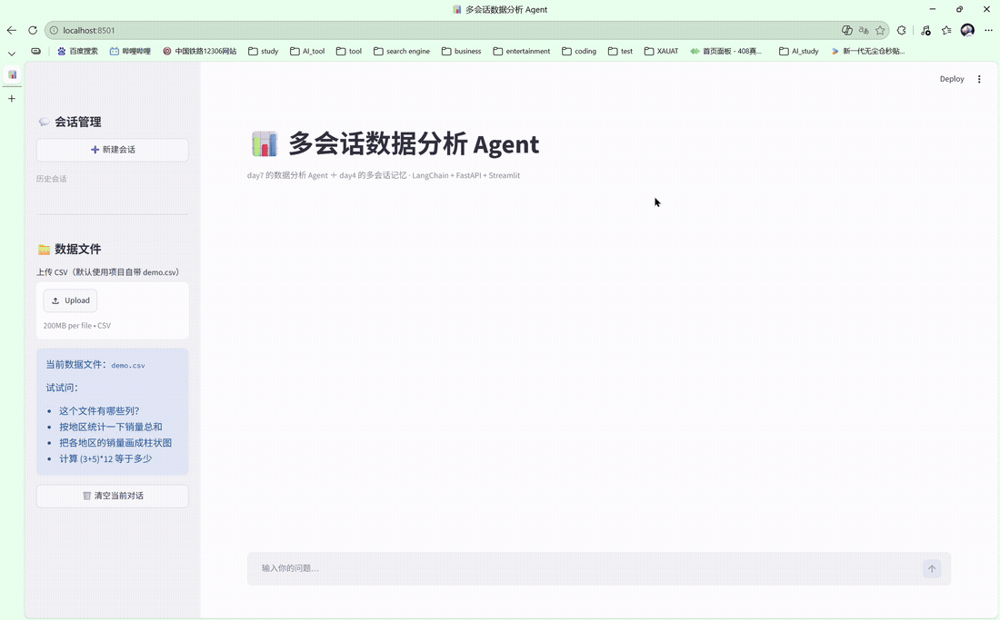
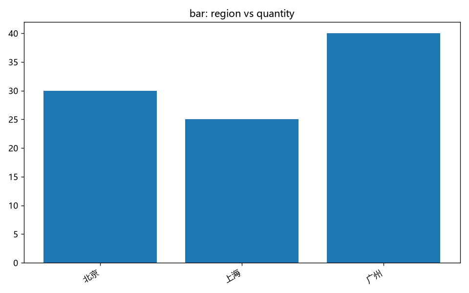
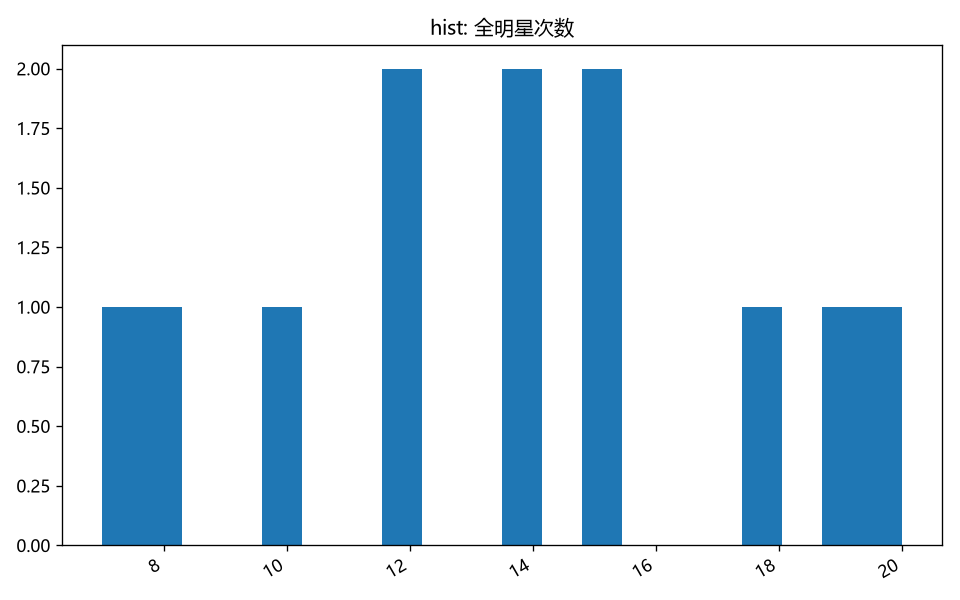
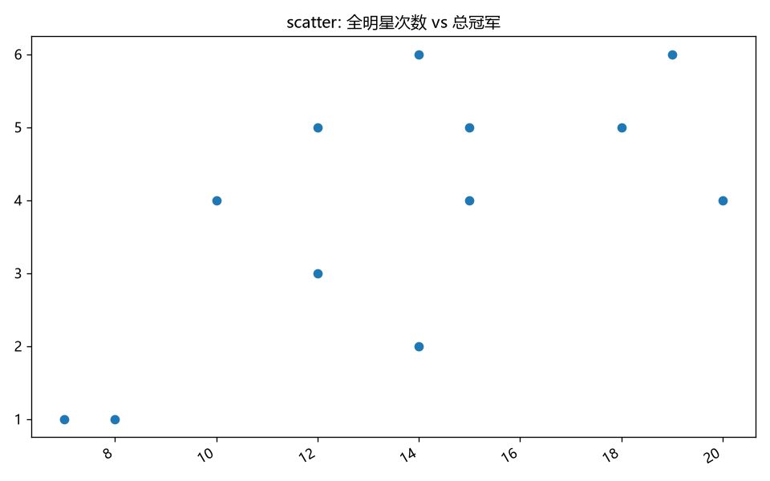

# 基于 LangChain Agent 的对话式数据分析与图表生成系统

> 上传 CSV，用自然语言提问，智能体自主调度 7 个工具完成取数、统计与出图 —— 把「写脚本做分析」压缩成「问一句话拿结果」。

## 功能特性

- **对话式分析**：用户不写代码，直接用自然语言提问，Agent 自主决定调用哪些工具、调用几次
- **7 个工具**：覆盖读文件、SQL 查询、描述统计、分组聚合、取值计数、画图、算术计算
- **图表自动生成**：matplotlib 出图，结果回显在对话流中
- **多会话管理**：新建 / 切换 / 删除会话，刷新页面与切换会话后历史与图表均不丢失
- **前后端分离**：FastAPI 提供接口，Streamlit 提供界面

## 效果展示

上传 CSV 后用自然语言提问，Agent 自主思考、调用工具、生成图表，全程无需写代码：



系统自动生成的图表示例：

| 「各地区金牌数对比」 | 「球员荣誉统计」 |
|---|---|
|  |  |

| 「全明星次数分布」 |
|---|
|  |

## 快速开始

```bash
# 1. 创建虚拟环境并安装依赖
python -m venv .venv
.venv\Scripts\activate          # Linux/Mac: source .venv/bin/activate
pip install -r requirements.txt

# 2. 配置密钥
cp .env.example .env
# 编辑 .env，填入你自己的 OPENAI_BASE_URL 与 OPENAI_API_KEY

# 3. 生成演示数据（可选，仓库已自带 demo.csv）
python create_csv.py

# 4. 启动后端（保持运行）
uvicorn api:app --reload --port 8000

# 5. 另开终端启动前端
streamlit run app.py
```

打开 Streamlit 页面后上传 CSV（可用 `uploads/` 下的示例数据），直接提问即可，例如：
「各地区的金牌数量分别是多少，画一张柱状图」。

## 工具箱

工具用 LangChain 的 `@tool` 装饰器声明，框架依据函数签名与 docstring 自动生成 JSON Schema 传给模型做 function calling。

| 工具 | 作用 |
|---|---|
| `read_csv` | 读取 CSV 并返回前 N 行预览，用于了解数据结构 |
| `sql_query` | 把 CSV 载入内存 SQLite，执行 SQL 查询并返回结果 |
| `stats_summary` | 对所有数值列计算均值、中位数、标准差、最值 |
| `stats_value_counts` | 统计某一列各取值的出现次数 |
| `stats_group_agg` | 按某列分组，对数值列求总和与平均值 |
| `make_chart` | 生成 line / bar / scatter / hist 四种图并保存 PNG |
| `calculator` | 安全计算纯算术表达式 |

新增一个工具的成本约 30 分钟：写一个带类型注解和 docstring 的函数、加 `@tool`、挂进 `agent.py` 的 `tools` 列表。

## 核心实现

### 1. Agent 循环

`create_agent` 托管「思考 → 调用工具 → 结果回填 → 继续思考」的完整循环，直到模型给出最终回答。业务代码只负责传入历史消息与取回结果。

```
用户提问 → 模型思考 → 选择工具 → 执行 → 观察结果 → 继续思考 → 最终回答 + 图表
```

此外对模型平台偶发的 `403 AccessDenied`（模型开通同步期间）做了 3 次自动重试。

### 2. 多会话记忆（memory.py）

带工具循环的 Agent 无法直接使用框架自带的记忆组件包装——中间的工具调用消息会被污染或丢失。本项目的做法是手写三段式记忆：

- **加载**：请求进入时按 `session_id` 取出完整消息历史
- **执行**：Agent 运行完整循环
- **保存**：回答结束后把 `result["messages"]`（含全部工具消息）回写

配套处理：
- 用 `threading.Lock` 保证 uvicorn 多线程下的数据安全
- 用正则从工具返回文本中提取图表路径，取代「对比目录前后差异」的做法，避免同名图表与并发场景下的漏报误报
- 前端展示时剥掉注入的「（当前数据文件: xxx）」前缀，还原干净的原始提问

### 3. 工具安全护栏

图表工具做了两层校验：图表类型白名单（模型偶尔会发明不支持的类型）、列名存在性校验（不存在时返回可用列名供模型纠正）。计算器工具限制为纯算术表达式，不做任意代码执行。

## 接口

| 方法 | 路径 | 说明 |
|---|---|---|
| GET | `/health` | 健康检查 |
| POST | `/chat` | 发送一轮提问，返回回答与图表路径 |
| GET | `/sessions` | 会话列表（侧边栏数据源） |
| GET | `/sessions/{id}` | 单会话历史（含图表归属） |
| DELETE | `/sessions/{id}` | 删除会话 |

## 项目结构

```
├── agent.py        # Agent 创建与单轮对话流程（含 403 重试）
├── api.py          # FastAPI 后端
├── app.py          # Streamlit 前端
├── llm.py          # 模型配置（从 .env 读取密钥）
├── memory.py       # 多会话记忆中心
├── create_csv.py   # 生成演示数据
├── tools/          # 7 个工具
│   ├── csv_tool.py
│   ├── sql_tool.py
│   ├── stats_tool.py
│   ├── chart_tool.py
│   └── calculator_tool.py
├── charts/         # 生成的图表示例
├── uploads/        # 上传的 CSV（仓库自带两份示例数据）
├── docs/           # 设计与整合说明
└── requirements.txt
```

## 技术栈

Python · LangChain · FastAPI · Streamlit · pandas · SQLite · matplotlib

## 已知局限

会话数据存于内存，后端重启后丢失。生产环境应把 `memory.py` 的 `_sessions` 换成 Redis 或数据库，对外接口无需改动。

## TODO

- [ ] 会话持久化（Redis / SQLite）
- [ ] 工具调用失败后的自动纠错重试
- [ ] 支持 Excel 与数据库直连
- [ ] 补充对话演示 GIF
